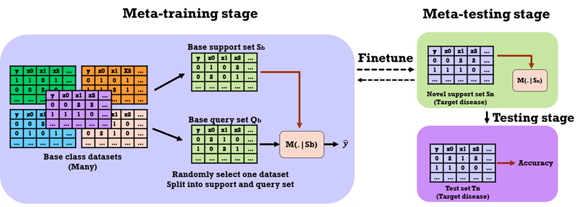

## Users’ Manual of meta-learning

## Overview
Aim to develop novel meta-learning algorithms to form accurate predictors for a focal disorder by utilizing the data of multiple related disorders. Then, we compared its performances against state-of-the-art machine learning models. Here, we focus on binary phenotypes (e.g., case vs. control), in which case is denoted as 1 and control is denoted as 0. We first start with brain disorders.

## Methods
### Single-marker selection:
First, I want to ensure that our genomic data is quality controlled. This step involves excluding markers with high missingness rate, high deviations from Hardy-Weinberg equilibrium, high discordance rates (if duplicate copies available), low minor allele frequency, and removing samples with high missingness rate, unusual heterozygosity, etc. All these steps are carried out using PLINK, the detail scripts can be found in the Codes/:
`1_filter.cmd`

### Meta-learning models implementation using PyTorch:
Based on an established package (https://github.com/wyharveychen/CloserLookFewShot) using meta-learning to process images, I have implemented the formulations of meta-learning using PyTorch (see Codes/).

1）For general training using stochastic gradient descent:
`train_jn.py`

2）For MAML:
`jn_maml.py`

3）For fine-tuning:
`finetune_jn.py`

4）For testing:
`test_jn.py`

5）For organizing parameters:
`backbone.py`
